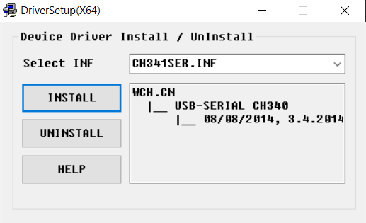

# Arduino Bootcamp 2023

## How to install the libraries

1. Open the Folder
2. Extract the file.
3. Double click on the executable file.
4. Click Install.

The driver should be installed and your machine can recognize all the Arduino boards.

### NOTE!
You cannot select multiple libraries. In case you have many libraries to install, install them one by one.

## Thank _You_!
Please :star: this repo to help us improve the quality.
  

## License
The content of this project is licenced under the [MIT License](../LICENSE).

## Contributing 💡
If you want to contribute to this project and make it better with new ideas, your pull request is very welcomed. 
If you find any issue just put it in the repository issue section, thanks!  
.سبحَانَكَ اللَّهُمَّ وَبِحَمْدِكَ، أَشْهَدُ أَنْ لا إِلهَ إِلأَ انْتَ أَسْتَغْفِرُكَ وَأَتْوبُ إِلَيْكَ
