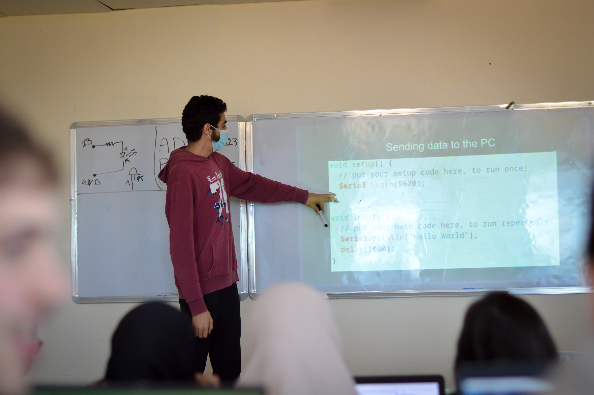

# Arduino Bootcamp 2023
[](LICENSE)


Welcome to the Arduino Bootcamp repository! This repository contains all the materials you need to get started with Arduino, from the fundamentals of electronics and programming to advanced topics like communication and display.


## Program Structure
Our program is structured as follows:

1. Basics
2. Fundamentals
3. Sensors
4. Actuators
5. Communication
6. Display

Each section builds on the previous one, so we recommend that you complete them in order. Within each section, you'll find slides, code examples, libraries, drivers, and challenges to help you solidify your understanding of the material.

## More Details
Our program is divided into six sessions, each building on the previous one. Here's an overview of what you'll learn in each session:

* [x] <b>Basics</b>: In this session, you'll learn about the basics of microcontrollers and how they're used in Arduino boards. We'll show you the different types of Arduino boards available and their features, so you can choose the best one for your project.
* [x] <b>Fundamentals</b>: In this session, we'll introduce you to the world of electronics and programming. You'll learn the basics of programming and how to use the Arduino IDE. We'll also show you some simple applications, like LED blinking and push buttons, to help you get started.
* [x] <b>Sensors</b>: In this session, you'll learn how to interface with different types of sensors, including LDR, Ultrasonic, DHT, and IR sensors. You'll learn how to read data from the sensors and display it in the serial monitor, so you can use this information to control your projects.
* [x] <b>Actuators</b>: In this session, you'll discover the different types of motors and how to control each one of them. You'll also learn how to choose the right type of motor for your project, based on your application.
* [x] <b>Communication</b>: In this session, you'll learn how to use the serial monitor and how to send and receive data between your laptop and the Arduino board. You'll also learn about the Bluetooth protocol and build an application to control an LED.
* [x] <b>Display</b>: In the final session, you'll learn how to use LCDs and seven segment displays to communicate with your users. You'll learn how to display different types of information, including animation and text scrolling, to create more interactive projects.


## Repository Structure
This repo is consisted of five main folders:

* [<b>Slides</b>](Slides): Itcontains PowerPoint presentations that we use to teach the material for each section. These slides provide an overview of the concepts covered in that section, as well as code snippets and diagrams to help explain the concepts.
* [<b>Codes</b>](Codes): It contains code examples that correspond to the material covered in each section. These examples are designed to help you get hands-on experience with the concepts covered in the slides.
* [<b>Drivers</b>](Drivers): It contains drivers that learners should install on their computers in order to use the Arduino board. These drivers allow your computer to communicate with the board via a USB port.
* [<b>Libraries</b>](Libraries): It contains the libraries that learners should install before including them in their code. These libraries provide additional functionality for the Arduino board, such as the ability to read from sensors or control actuators.
* [<b>Challenges</b>](Challenges): It contains challenges that learners can complete to test their understanding of the material covered in each section. These challenges are designed to be fun and engaging, while also helping learners develop their Arduino programming skills.


## Thank _You_!
Please :star: this repo to help us improve the quality.
<br><br>


## Media
Here are some pictures taken during our Arduino Bootcamp!

Participants Pictures After the Bootcamp
:---------------------:


## Pictures Captured During The Bootcamp
Workshop Picture 1           | Workshop Picture 2
:---------------------:|:------------------:
 | 
Workshop Picture 3         |  Workshop Picture 4
 | 
Workshop Picture 5         |  Workshop Picture 6
 | 
Workshop Picture 7         |  Workshop Picture 8
 | 

## Requirements

If you want to get started with Arduino coding, you only need to install Arduino IDE software to your machine.

* Go to the <a href="https://www.arduino.cc/en/software">Official Arduino IDE Download Page</a>.
* We recommend you to install the old version (v1.8.19), scroll down to find it.
* Select your operating system.
* Download the executable file and install it.


## Get Started

1. Install this repository, click <a href="https://github.com/electro-sc/Arduino-Bootcamp-2023/archive/master.zip"> here </a> to install it. Or use git command:
```bach
git clone https://github.com/electro-sc/Arduino-Bootcamp-2023.git
```
2. Extract the folder and open it.
3. Navigate for the [Slides](Slides) folder in order to see our presentations.
4. Navigate for the [Codes](Codes) folder in order to see examples provided by us.


## License
The content of this project is licenced under the [MIT License](LICENSE).

## Contributing 💡
If you want to contribute to this project and make it better with new ideas, your pull request is very welcomed.<br>
If you find any issue just put it in the repository issue section, thanks!<br><br>
.سبحَانَكَ اللَّهُمَّ وَبِحَمْدِكَ، أَشْهَدُ أَنْ لا إِلهَ إِلأَ انْتَ أَسْتَغْفِرُكَ وَأَتْوبُ إِلَيْكَ
